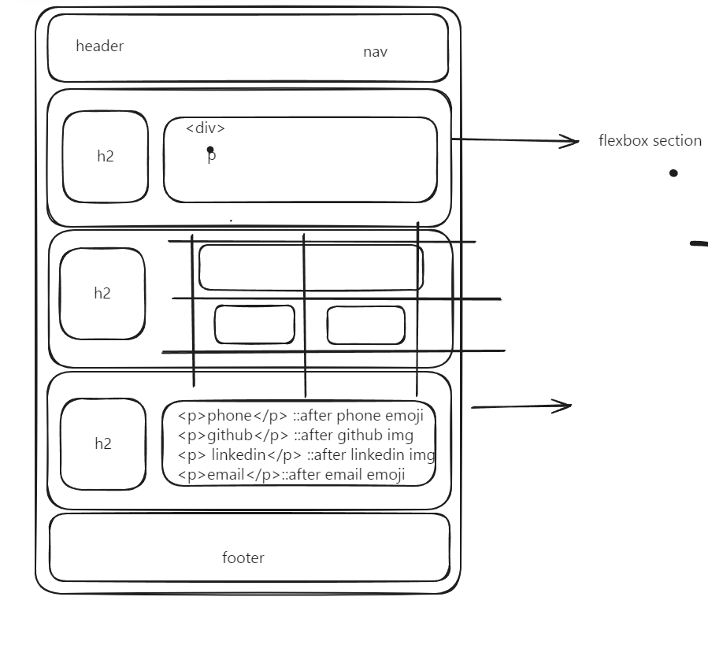
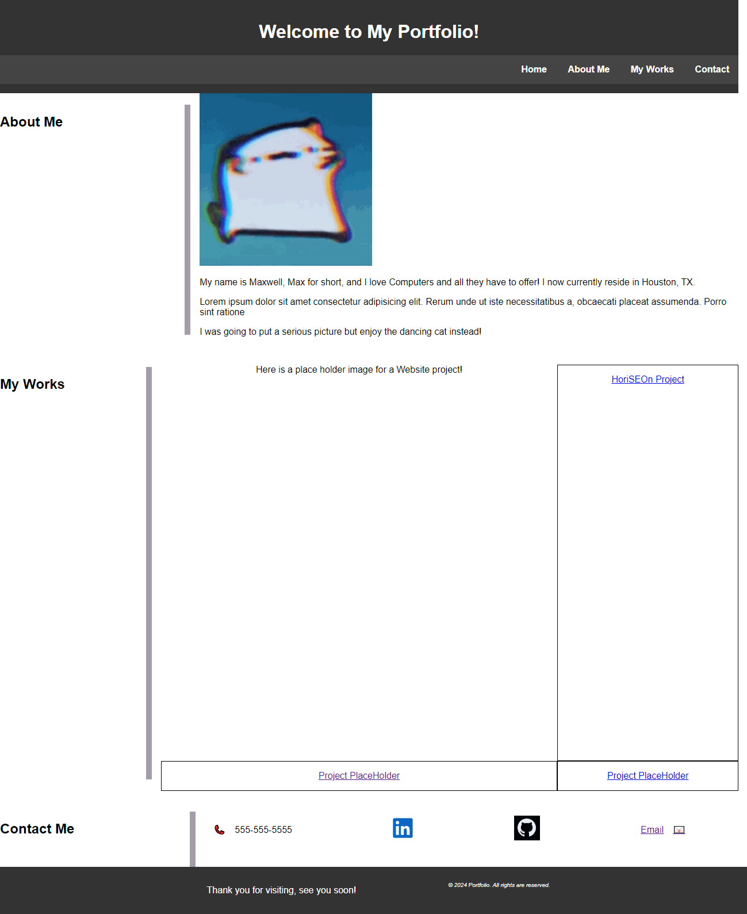

# Portfolio

## Description
This portfolio project was created to test my skills with HTML flexbox and CSS styling.

## Links
/* Link to my repo */
https://github.com/maxbonetti/portfolio

/* Link to pages of portfolio project */
https://maxbonetti.github.io/portfolio/

## Credits
CSS Reset Page -
http://meyerweb.com/eric/tools/css/reset/ 
   v2.0 | 20110126
   License: none (public domain)

WireFrame : https://excalidraw.com/

[W3schools.com](https://www.w3schools.com/)
[mdn](https://developer.mozilla.org/en-US/)
   
## Technology
HTML 5, CSS 3, 

## Pictures
WireFrame 

Full portfolio 

